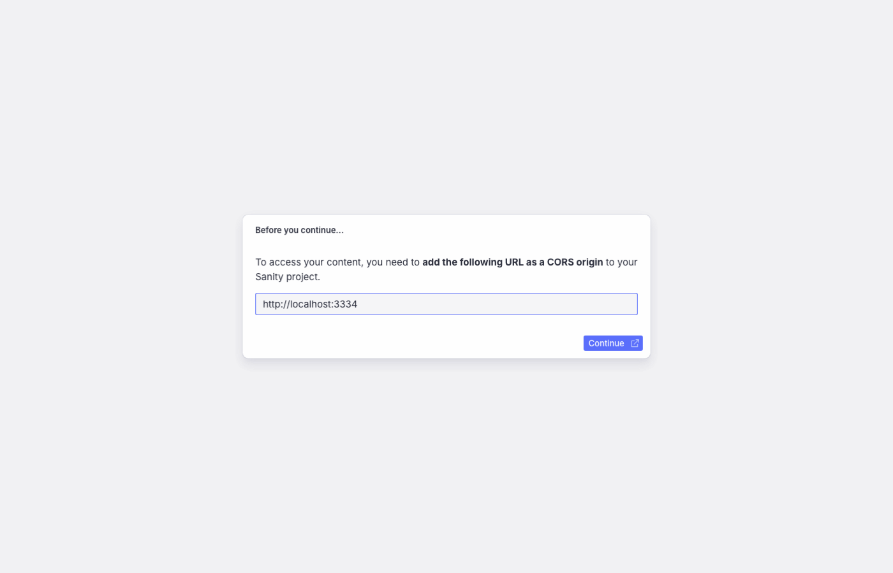
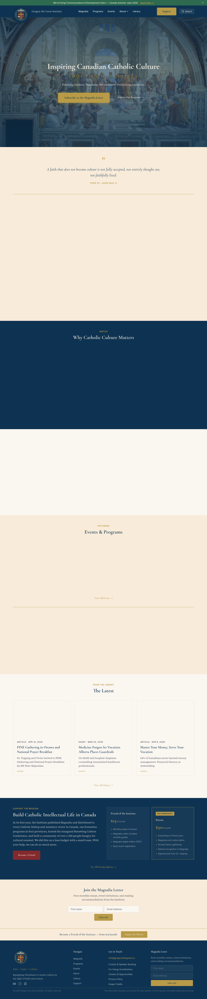
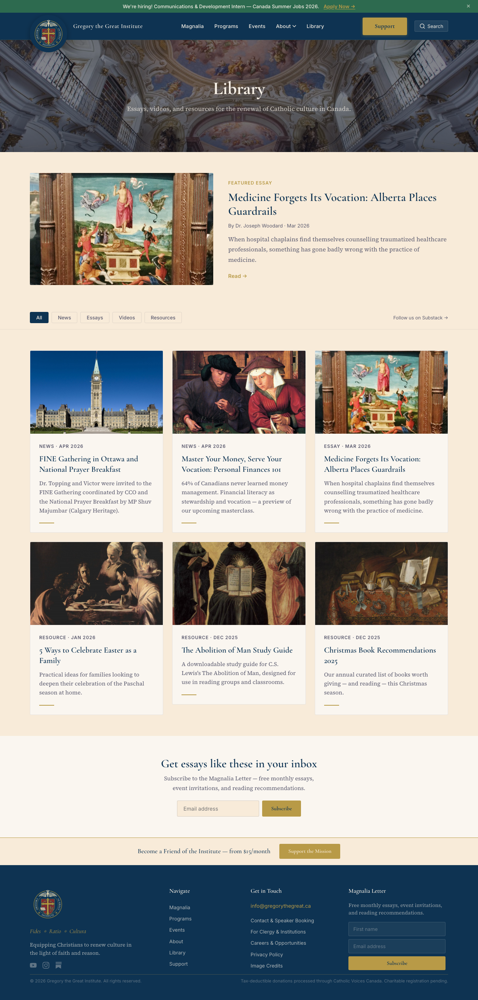
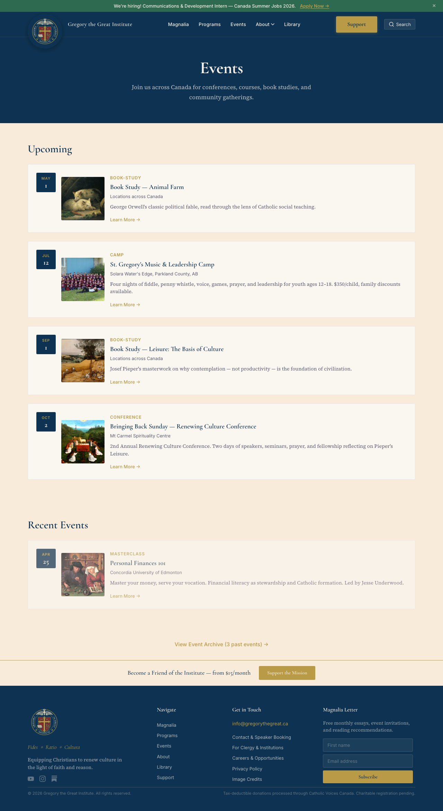
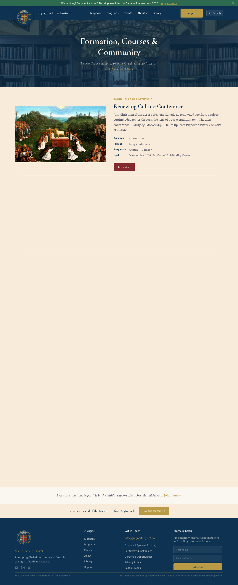
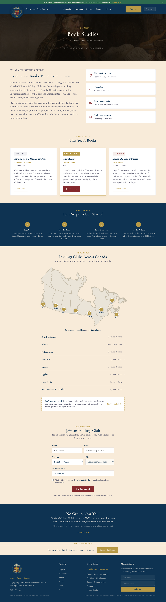
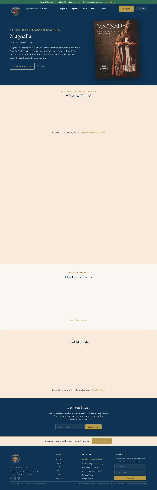
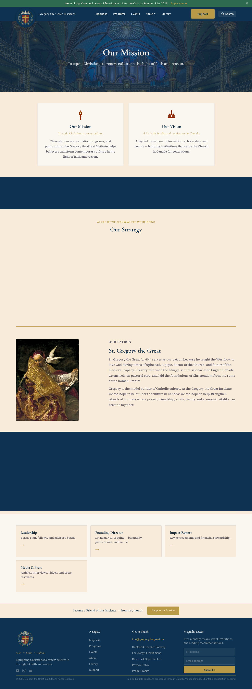
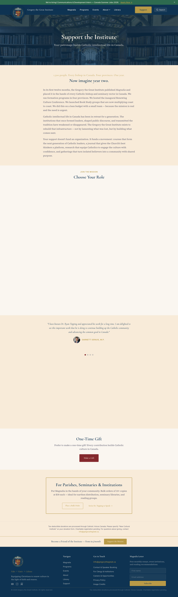
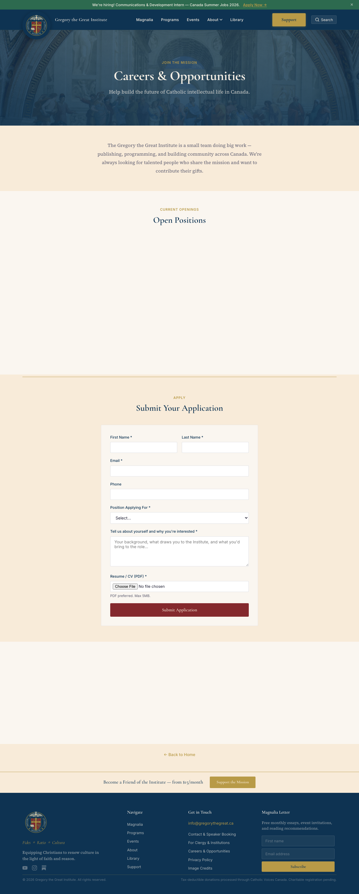

# Sanity CMS Guide — Gregory the Great Institute

**How to manage content on the GGI website**
Last updated: April 2026

---

## Table of Contents

1. [Getting Started](#getting-started)
2. [The Sidebar — Your Content Map](#the-sidebar)
3. [Homepage](#homepage)
4. [Library (Articles & Resources)](#library)
5. [Events](#events)
6. [Programs](#programs)
7. [Book Studies](#book-studies)
8. [Reading Groups (Map)](#reading-groups)
9. [Magnalia Issues](#magnalia-issues)
10. [People](#people)
11. [Giving Tiers](#giving-tiers)
12. [Career Postings](#career-postings)
13. [Site Settings](#site-settings)
14. [Tags](#tags)
15. [SEO (Every Page)](#seo)
16. [Publishing Changes](#publishing-changes)
17. [Common Tasks](#common-tasks)

---

## 1. Getting Started

Sanity Studio is the editing dashboard for the GGI website. It's where you add events, articles, people, book studies, and more — without touching any code.

**To open Sanity Studio:**
```
cd ~/GGI-Website/ggi-website/sanity
npx sanity dev
```
Then open **http://localhost:3333** in your browser.

> **Future:** Once hosted online, you'll just visit a URL like `studio.gregorythegreat.ca` — no terminal needed.

---

## 2. The Sidebar — Your Content Map



The sidebar organizes all your content into sections:

| Sidebar Item | What It Manages | Where It Appears on the Site |
|---|---|---|
| ⚙️ Site Settings | Global info (contact, social links, banner) | Every page (footer, header) |
| 🏠 Homepage | Hero text, CTA buttons, video | [Homepage](https://evanr-web.github.io/ggi-website/) |
| 📚 Library | Articles, essays, videos, resources | [Library page](https://evanr-web.github.io/ggi-website/library/) |
| 🎓 Programs | Program descriptions and details | [Programs page](https://evanr-web.github.io/ggi-website/programs/) |
| 📅 Events | Conferences, book studies, camps | [Events page](https://evanr-web.github.io/ggi-website/events/) |
| 📖 Magnalia Issues | Magazine issues, covers, content | [Magnalia page](https://evanr-web.github.io/ggi-website/magnalia/) |
| 📕 Book Studies | This year's reading list | [Book Studies page](https://evanr-web.github.io/ggi-website/programs/book-studies/) |
| 🗺️ Reading Groups | Cities and group counts (map data) | [Book Studies map](https://evanr-web.github.io/ggi-website/programs/book-studies/) |
| 👤 People | Board, staff, contributors | [Leadership page](https://evanr-web.github.io/ggi-website/about/leadership/) |
| 💰 Giving Tiers | Friend, Patron, Leadership pricing | [Support page](https://evanr-web.github.io/ggi-website/support/) |
| 💼 Career Postings | Job listings | [Careers page](https://evanr-web.github.io/ggi-website/careers/) |

---

## 3. Homepage


**What you can edit:**
- **Hero Headline** — the big text visitors see first
- **Hero Subtitle** — the line underneath
- **Hero Image** — background image (recommended: 1920×1080px)
- **Primary CTA** — main button (text + link)
- **Secondary CTA** — second button (text + link)
- **Video URL** — YouTube video in the "Why Catholic Culture Matters" section
- **Video Caption** — text below the video

**Where it appears on the site:**



---

## 4. Library (Articles & Resources)


The Library section is organized into sub-views to help you manage content as it grows:

- **All Items** — every article, video, and resource
- **Essays** — filtered to essays only
- **Videos & Lectures** — filtered to video content only
- **Resources** — filtered to downloadable resources only
- **⭐ Featured** — items marked as "Featured" (shown prominently on the Library page)
- **🏷️ Manage Tags** — create and edit topic tags

### Adding a New Article

1. Click **📚 Library** → **All Items**
2. Click the **+** button (top right)
3. Fill in:
   - **Title** — the article headline
   - **Slug** — auto-generated from the title (this becomes the URL)
   - **Author** — pick from People list
   - **Publish Date** — when it was published
   - **Category** — Essay, Video, or Resource
   - **Tags** — select relevant topics (Aquinas, Education, Beauty, etc.)
   - **Excerpt** — short description for the card (under 200 characters)
   - **Body** — the full article content (rich text editor)
   - **Featured** — check this to show it prominently on the Library page
4. Click **Publish**

**Where it appears on the site:**



Each article gets its own page at `/library/article-slug/`.

---

## 5. Events


### Adding a New Event

1. Click **📅 Events**
2. Click **+**
3. Fill in:
   - **Title** — event name
   - **Slug** — becomes the URL
   - **Template** — choose the page layout (Conference, Book Study, Camp, etc.)
   - **Status** — Upcoming, Open, Sold Out, Past
   - **Start Date / End Date**
   - **Location** — venue name and address
   - **Header Image** — hero image for the event page
   - **Short Description** — for event cards
   - **Registration URL** — link to sign up (Zeffy, Google Form, etc.)
   - **Cost** — pricing info
   - **Capacity** — max attendees (optional)
4. Click **Publish**

**Where it appears on the site:**



Events appear on the Events page as cards. Past events (30+ days old) move to the Archive automatically.

---

## 6. Programs


Programs are the major ongoing initiatives (Book Studies, Faith & Reason, Masterclasses, Conference, Music Camp).

**What you can edit:**
- Title, description, tagline
- Header image
- Audience, format, frequency
- Pricing and registration URL
- **Testimonials** — add quotes from participants (these appear as a carousel on the program page)
- **SEO** — meta title, description, OG image

**Where it appears on the site:**



### Adding Testimonials

1. Open a program (e.g., "Book Studies")
2. Scroll to **Testimonials**
3. Click **Add item**
4. Enter the **Quote** and **Attribution** (e.g., "Parent, Edmonton")
5. Publish

Testimonials appear as an auto-sliding carousel at the bottom of the program page. If there are no testimonials, nothing shows — the section is hidden automatically.

---

## 7. Book Studies


This controls the "This Year's Books" section on the Book Studies page.

### Adding a New Book Study

1. Click **📕 Book Studies**
2. Click **+**
3. Fill in:
   - **Book Title** — the book name
   - **Author** — who wrote it
   - **Description** — why we're reading it
   - **Month** — when the study happens
   - **Year** — which year
   - **Status** — Upcoming, Current Study, or Completed
   - **Event Page URL** — path to the event page (e.g., `/events/book-study-sep-2026/`)
   - **Sort Order** — lower numbers appear first
4. Click **Publish**

**What automatically updates on the site:**
- The "Three studies per year · February · May · September" line updates based on how many studies exist and their months
- Book cards show with the correct status badge (Completed / Current / Upcoming)
- CTA buttons change based on status

**Where it appears on the site:**



---

## 8. Reading Groups (Map)


This controls the interactive Canada map on the Book Studies page.

### Adding a New Reading Group

1. Click **🗺️ Reading Groups**
2. Click **+**
3. Fill in:
   - **Province** — select from dropdown
   - **City** — the city name
   - **Number of Groups** — how many groups in that city
   - **Active** — uncheck to hide without deleting
   - **Contact Name / Email** — internal only (never shown on site)
   - **Notes** — internal notes
4. Click **Publish**

The map pin for that province will update, and the city will appear in the accordion list with the correct group count.

### Updating Group Counts

When a new group forms in an existing city, just open that city's document and increase the number.

---

## 9. Magnalia Issues


Each issue of the Magnalia magazine is a document with:
- Issue number, title, publish date
- Cover image
- Table of contents
- Editor's note
- Sample article (full rich text)
- Contributors list
- Pull quote and endorsements

Mark one issue as **Current** to feature it on the Magnalia page.

**Where it appears on the site:**



---

## 10. People


Manages everyone shown on the site — board members, staff, contributors.

**Fields:**
- Name, role, short bio
- Photo (recommended: square, 400×400px minimum)
- Person Type (Board, Staff, Contributor, Advisor)
- Credentials (degrees, titles)
- Email (optional)
- Published toggle (hide without deleting)

**Where it appears on the site:**



People appear on the Leadership page, grouped by type.

---

## 11. Giving Tiers


Controls the giving levels shown on the Support page.

**Fields:**
- Name (Friend, Patron, Leadership Circle)
- Monthly and annual prices
- Description
- Benefits list
- CTA text and link
- Featured toggle (highlights one tier)

**Where it appears on the site:**



---

## 12. Career Postings


Job listings with:
- Title, type (Full-time, Part-time, Internship)
- Location, compensation, deadline
- Description (rich text)
- PDF attachment for full details
- Active toggle

**Where it appears on the site:**



Only active postings are shown. Uncheck "Active" when the position is filled.

---

## 13. Site Settings


Global settings that affect every page:

- **Ribbon Banner** — the colored bar at the top of the site (text + link + color)
- **Fly-in Popup** — optional popup (heading, text, CTA, delay)
- **Social Links** — Instagram, YouTube, Facebook, Twitter URLs
- **Contact Email** — shown in footer and contact page
- **Mailing Address** — shown in footer
- **Footer Tagline & Mission** — text in the footer
- **Charitable Registration** — CRA number (important for donor trust)
- **Logo** — site logo image

---

## 14. Tags


Tags let you categorize library items by topic. The system comes with 20 starter tags:

Aquinas · Education · Beauty · Liturgy · Culture · Philosophy · Theology · Marriage & Family · Classical Education · Catholic Social Teaching · Literature · History · Personal Finance · Leadership · Evangelization · Sacred Art · Music · Prayer · Saints · Scripture

**To add a new tag:**
1. Go to **📚 Library** → **🏷️ Manage Tags**
2. Click **+**
3. Enter the tag name and generate the slug
4. Publish

Tags are then available when editing any Library Item.

---

## 15. SEO (Every Page)

Most content types have an **SEO** section at the bottom of the edit form:

- **Meta Title** — the title shown in Google search results and browser tabs (under 60 characters)
- **Meta Description** — the snippet shown under the title in search results (under 160 characters)
- **OG Image** — the image shown when the page is shared on Facebook, Twitter, iMessage, etc. (recommended: 1200×630px)

If left blank, the system uses sensible defaults (the content title and description).

**Tip:** For important pages (programs, events, key articles), always fill in the SEO fields. It makes a noticeable difference in how the site appears in search results and social shares.

---

## 16. Publishing Changes

After editing content in Sanity, the changes need to be **deployed** to appear on the live site.

### Current process (staging):
1. Edit content in Sanity Studio
2. Ask the developer to rebuild and push

### Future process (production on Cloudflare):
1. Edit content in Sanity Studio
2. Changes deploy automatically within 2 minutes (via webhook)

**Important:** The site is "statically built" — this means it's incredibly fast and secure, but content changes aren't instant. There's always a short rebuild step. This is a feature, not a limitation — it's what makes the site load so quickly.

---

## 17. Common Tasks

### "I need to add a new event"
📅 Events → **+** → fill in details → Publish → request rebuild

### "I need to update this year's book list"
📕 Book Studies → edit existing or add new → update Status field → Publish

### "A new reading group started in Winnipeg"
🗺️ Reading Groups → find Winnipeg → increase group count → Publish

### "I want to add a new article to the Library"
📚 Library → All Items → **+** → fill in details → add Tags → Publish

### "I need to change the hero text on the homepage"
🏠 Homepage → edit Hero Headline / Subtitle → Publish

### "Someone joined the board"
👤 People → **+** → fill in name, role, bio, photo → set Person Type to "Board" → Publish

### "I want to hide a job posting"
💼 Career Postings → open the posting → uncheck "Active" → Publish

### "I want to add a testimonial to the Book Studies program"
🎓 Programs → open "Book Studies" → scroll to Testimonials → Add item → Publish

### "I need to update the site banner"
⚙️ Site Settings → edit Ribbon Banner text/link/color → Publish

---

## 18. Reverting Changes (Revision History)

Every edit you make in Sanity Studio is automatically saved and versioned. If you accidentally delete content, overwrite text, or just want to undo a change, you can restore any previous version of a document.

### How to revert a document:

1. **Open the document** you want to restore (e.g., an event, article, or person)
2. **Click the clock icon** (🕐) in the top-right corner of the document editor — this opens the revision history panel
3. **Browse the timeline** — you'll see every saved version listed with timestamps and who made the change
4. **Click on a previous version** to preview what the document looked like at that point
5. **Click "Restore"** to revert the document back to that version
6. **Publish** the restored version to make it live

### Good to know:
- Revision history is **automatic** — you don't need to do anything to enable it
- **Every field change** is tracked, not just publishes
- You can restore from **any point in a document's history**, not just the last save
- Restoring does not delete the newer versions — they remain in the history, so you can always go back again
- This works for **all document types**: events, articles, people, site settings, homepage, etc.

### "I accidentally deleted a document"
If you delete an entire document (not just edited it), it moves to a "deleted" state. Contact the developer to recover it from the dataset — deleted documents can be restored via the Sanity API.

---

*For technical questions or issues with Sanity Studio, contact the developer. For content questions, refer to the editorial guidelines or contact the Communications lead.*
